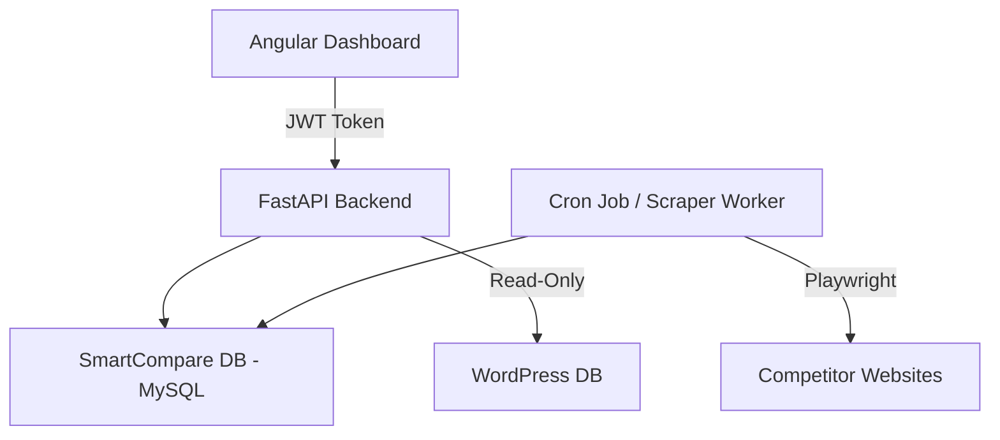
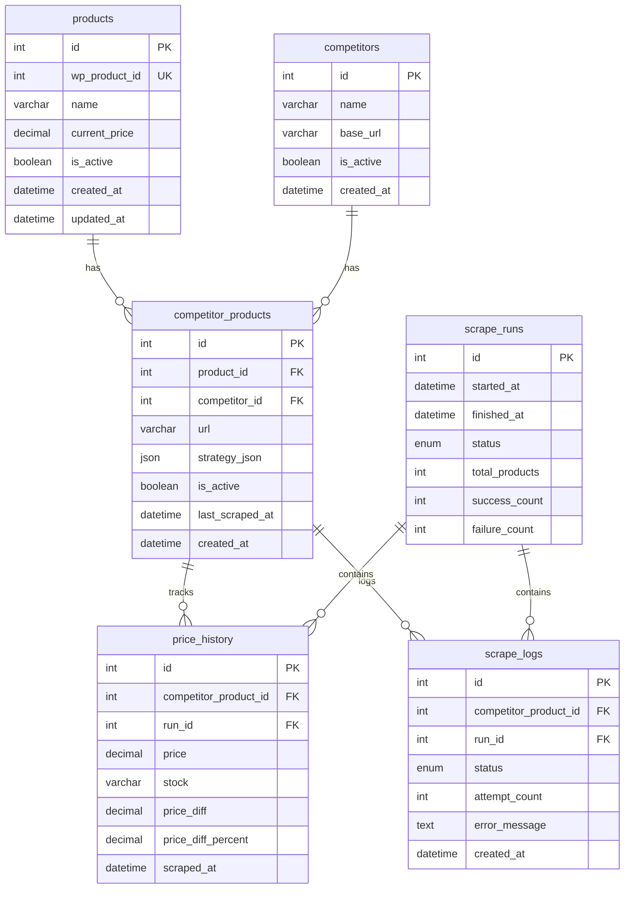
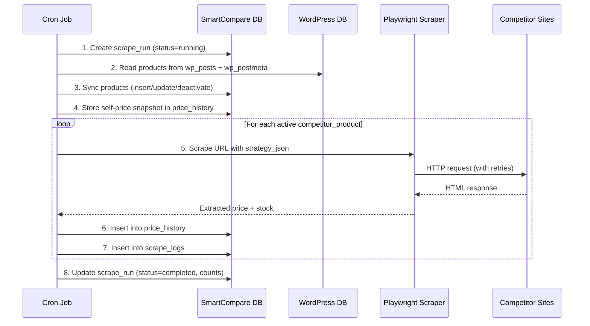

# SmartCompare Architecture & Process

## Overview
SmartCompare is a price intelligence system integrated with WooCommerce (WordPress). It collects product data, tracks historical pricing, scrapes competitor prices, and provides analytics.

---

## High-Level Architecture

```
Angular Dashboard (SPA)
        ↓  (JWT Auth)
    FastAPI Backend
        ↓
 SmartCompare Database (MySQL)
        ↑
 Scraper Worker (Cron Job)
        ↑
 Competitor Websites

FastAPI (read-only) → WordPress Database
```



---

## Technology Stack

| Layer      | Technology                     |
|------------|--------------------------------|
| Backend    | FastAPI (Python 3.10+)         |
| Frontend   | Angular 17+                    |
| Database   | MySQL (separate DB: `smartcompare`) |
| Scraper    | Playwright (Python, async)     |
| Scheduler  | cPanel Cron / systemd timer    |
| Auth       | Simple JWT (python-jose + passlib) |

---

## Authentication (Simple JWT)

Since this is a test/internal project, use a lightweight JWT setup:

- **Single admin user** — credentials stored in `.env` (hashed password)
- **Login endpoint** returns a JWT access token (expires in 24h)
- **Protected routes** require `Authorization: Bearer <token>` header
- No refresh tokens needed for a test project

### Auth Endpoints

| Method | Endpoint       | Description           | Auth |
|--------|----------------|-----------------------|------|
| POST   | `/auth/login`  | Login, returns JWT    | No   |
| GET    | `/auth/me`     | Get current user info | Yes  |

### .env Example

```env
ADMIN_USERNAME=admin
ADMIN_PASSWORD_HASH=$2b$12$...  # bcrypt hash
JWT_SECRET=your-random-secret-key
JWT_EXPIRY_HOURS=24
```

---

## Database Design

### ER Diagram



### Table Details

#### 1. products
| Column        | Type         | Notes                          |
|---------------|--------------|--------------------------------|
| id            | INT, PK, AI  |                                |
| wp_product_id | INT, UNIQUE  | Links to WooCommerce           |
| name          | VARCHAR(255) |                                |
| current_price | DECIMAL(10,2)|                                |
| is_active     | BOOLEAN      | Default: true                  |
| created_at    | DATETIME     | Auto-set on insert             |
| updated_at    | DATETIME     | Auto-set on insert & update    |

#### 2. competitors
| Column     | Type         | Notes              |
|------------|--------------|---------------------|
| id         | INT, PK, AI  |                     |
| name       | VARCHAR(100) | e.g. "Daraz"        |
| base_url   | VARCHAR(255) | e.g. "https://daraz.com.bd" |
| is_active  | BOOLEAN      | Default: true       |
| created_at | DATETIME     |                     |

#### 3. competitor_products
| Column          | Type         | Notes                    |
|-----------------|--------------|--------------------------|
| id              | INT, PK, AI  |                          |
| product_id      | INT, FK      | → products.id            |
| competitor_id   | INT, FK      | → competitors.id         |
| url             | VARCHAR(500) | Full product page URL    |
| strategy_json   | JSON         | Scraping selectors       |
| is_active       | BOOLEAN      | Default: true            |
| last_scraped_at | DATETIME     | Nullable                 |
| created_at      | DATETIME     |                          |

#### 4. scrape_runs
| Column        | Type         | Notes                              |
|---------------|--------------|-------------------------------------|
| id            | INT, PK, AI  |                                     |
| started_at    | DATETIME     |                                     |
| finished_at   | DATETIME     | Nullable until complete             |
| status        | ENUM         | `running`, `completed`, `failed`    |
| total_products| INT          | Total competitor_products attempted |
| success_count | INT          | Default: 0                          |
| failure_count | INT          | Default: 0                          |

#### 5. price_history
| Column                | Type          | Notes                                       |
|-----------------------|---------------|----------------------------------------------|
| id                    | INT, PK, AI   |                                              |
| competitor_product_id | INT, FK       | → competitor_products.id                     |
| run_id                | INT, FK       | → scrape_runs.id                             |
| price                 | DECIMAL(10,2) |                                              |
| stock                 | VARCHAR(50)   | e.g. `in_stock`, `out_of_stock`              |
| price_diff            | DECIMAL(10,2) | `competitor_price - our_price` at scrape time|
| price_diff_percent    | DECIMAL(5,2)  | `(diff / our_price) * 100`                   |
| scraped_at            | DATETIME      |                                              |

**Unique constraint:** `(competitor_product_id, run_id)` — prevents duplicate entries per run.

**price_diff clarification:**
- Positive = competitor is more expensive
- Negative = competitor is cheaper
- Calculated as: `scraped_price - products.current_price` at the moment of scraping

#### 6. scrape_logs
| Column                | Type          | Notes                           |
|-----------------------|---------------|---------------------------------|
| id                    | INT, PK, AI   |                                 |
| competitor_product_id | INT, FK       | → competitor_products.id        |
| run_id                | INT, FK       | → scrape_runs.id                |
| status                | ENUM          | `success`, `failed`             |
| attempt_count         | INT           | 1–3                             |
| error_message         | TEXT          | Nullable, only on failure       |
| created_at            | DATETIME      |                                 |

---

## API Endpoints

### Products

| Method | Endpoint                        | Description                     | Auth |
|--------|----------------------------------|---------------------------------|------|
| GET    | `/products`                      | List all products (paginated)   | Yes  |
| GET    | `/products/{id}`                 | Get single product details      | Yes  |
| GET    | `/products/{id}/price-history`   | Price history for a product     | Yes  |
| POST   | `/products/sync`                 | Trigger WP sync manually        | Yes  |

### Competitors

| Method | Endpoint                         | Description                    | Auth |
|--------|----------------------------------|--------------------------------|------|
| GET    | `/competitors`                   | List all competitors           | Yes  |
| POST   | `/competitors`                   | Add a competitor               | Yes  |
| PUT    | `/competitors/{id}`              | Update competitor              | Yes  |
| DELETE | `/competitors/{id}`              | Soft-delete (set is_active=false) | Yes |

### Competitor Products (Mappings)

| Method | Endpoint                              | Description                     | Auth |
|--------|---------------------------------------|---------------------------------|------|
| GET    | `/competitor-products`                | List all mappings               | Yes  |
| POST   | `/competitor-products`                | Add mapping + strategy          | Yes  |
| PUT    | `/competitor-products/{id}`           | Update URL / strategy           | Yes  |
| DELETE | `/competitor-products/{id}`           | Soft-delete                     | Yes  |

### Scraping

| Method | Endpoint                    | Description                        | Auth |
|--------|-----------------------------|------------------------------------|------|
| POST   | `/scrape/run`               | Trigger a scrape run manually      | Yes  |
| GET    | `/scrape/runs`              | List past scrape runs              | Yes  |
| GET    | `/scrape/runs/{id}`         | Details of a specific run          | Yes  |
| GET    | `/scrape/runs/{id}/logs`    | Logs for a specific run            | Yes  |

### Dashboard / Analytics

| Method | Endpoint                    | Description                              | Auth |
|--------|---------------------------  |------------------------------------------|------|
| GET    | `/dashboard/summary`        | Overview stats (product count, last run)  | Yes  |
| GET    | `/dashboard/price-comparison` | Side-by-side price table               | Yes  |

---

## Core Process Flow

### Scrape Run Sequence Diagram



### Step-by-Step Execution

```
[CRON START]

1. Create scrape_run entry (status = "running")

2. Sync products from WordPress
   - Read wp_posts (post_type = "product") + wp_postmeta (_price)
   - Also read product_variation post types for variable products
   - Insert new products
   - Update changed fields (name, price)
   - Set is_active = false if product no longer exists in WP

3. Store self-price snapshot
   - Treat own store as a "self" competitor
   - Insert current_price into price_history
   - price_diff = 0, price_diff_percent = 0

4. Run competitor scraping
   For each active competitor_product:
     - Load strategy_json for selectors
     - Attempt scraping (max 3 retries, 30s timeout each)
     - Parse extracted text → clean numeric price
     - Calculate price_diff = scraped_price - our current_price
     - Calculate price_diff_percent = (price_diff / our_price) * 100
     - Store in price_history
     - Log result in scrape_logs (success or failure + error)
     - Update competitor_products.last_scraped_at

5. Update scrape_run
   - Set finished_at, status, success_count, failure_count

[CRON END]
```

---

## WordPress Sync Logic

- **Read-only connection** to the WordPress database
- Source tables: `wp_posts`, `wp_postmeta`

### Query Logic

```sql
SELECT p.ID, p.post_title, pm.meta_value AS price
FROM wp_posts p
JOIN wp_postmeta pm ON p.ID = pm.post_id AND pm.meta_key = '_price'
WHERE p.post_type IN ('product', 'product_variation')
  AND p.post_status = 'publish'
```

### Sync Rules

- **New product in WP** → INSERT into `products`
- **Price/name changed** → UPDATE in `products`
- **Product removed from WP** → SET `is_active = false` (never hard-delete)
- **Variable products**: Each variation is treated as a separate product entry with its own price

---

## Scraping Strategy System

Each `competitor_product` contains a JSON strategy:

```json
{
  "price_selector": ".product-price .amount",
  "stock_selector": ".stock-status",
  "price_attribute": "textContent",
  "currency_symbol": "৳",
  "wait_for": ".product-price"
}
```

### Field Descriptions

| Field            | Required | Description                                    |
|------------------|----------|------------------------------------------------|
| price_selector   | Yes      | CSS selector to locate the price element        |
| stock_selector   | No       | CSS selector for stock status                   |
| price_attribute  | No       | Default: `textContent`. Can be `data-price` etc.|
| currency_symbol  | No       | Stripped during price parsing                    |
| wait_for         | No       | Selector to wait for before extracting (for JS-rendered pages) |

### Price Parsing Rules

```python
raw_text = "৳1,200.00"
# 1. Remove currency symbol → "1,200.00"
# 2. Remove commas → "1200.00"
# 3. Convert to Decimal → Decimal("1200.00")
# 4. If parsing fails → log error, skip entry
```

### Supported Methods (Current & Future)

- ✅ CSS selectors (current)
- 🔜 XPath selectors
- 🔜 API-based scraping (if competitor has a public API)

---

## Retry Mechanism

- **Max attempts:** 3 per competitor_product
- **Timeout:** 30 seconds per request
- **Delay between retries:** 2 seconds

```python
for attempt in range(1, 4):
    try:
        result = await scrape(url, strategy)
        log_success(competitor_product_id, run_id, attempt)
        break
    except Exception as e:
        if attempt == 3:
            log_failure(competitor_product_id, run_id, attempt, str(e))
```

---

## Concurrency & Rate Limiting

| Setting                | Value   | Notes                          |
|------------------------|---------|--------------------------------|
| Max concurrent scrapes | 5       | Use asyncio.Semaphore          |
| Delay between requests | 2s      | Per domain, to avoid rate-limits|
| Page load timeout      | 30s     | Playwright timeout              |
| Total run timeout      | 30 min  | Kill run if exceeded            |

```python
semaphore = asyncio.Semaphore(5)

async def scrape_with_limit(task):
    async with semaphore:
        await asyncio.sleep(2)  # polite delay
        return await scrape(task)
```

---

## Logging & Monitoring

All scraping results are logged in `scrape_logs`:

- ✅ Success entries — with attempt count
- ❌ Failure entries — with error message and attempt count

### Cron Failure Notification (Basic)

For the test project, log cron failures to a file and optionally send an email:

```python
import smtplib

def notify_failure(run_id, error):
    # Log to file always
    logger.error(f"Run {run_id} failed: {error}")
    
    # Optional: simple email alert
    if SMTP_ENABLED:
        send_email(subject=f"SmartCompare Run #{run_id} Failed", body=str(error))
```

---

## Data Integrity Rules

- **Unique constraint:** `(competitor_product_id, run_id)` on `price_history`
- **Unique constraint:** `(competitor_product_id, run_id)` on `scrape_logs`
- **Foreign keys:** All FK relationships enforced at DB level
- Always attach `run_id` to every price and log entry
- Soft-delete pattern: use `is_active` flags instead of DELETE

---

## Deployment Notes (Test Project)

### Option A: VPS / Local Machine (Recommended for Playwright)

```
- FastAPI: uvicorn main:app --host 0.0.0.0 --port 8000
- Angular: ng build → serve via Nginx or FastAPI static files
- Playwright: installed via `pip install playwright && playwright install chromium`
- Cron: systemd timer or crontab
- MySQL: local or remote
```

### Option B: cPanel Shared Hosting

> ⚠️ **Warning:** Most shared hosts do NOT support Playwright (no headless browser binaries allowed). Consider using `requests + BeautifulSoup` as a fallback for static pages, or use a VPS for the scraper.

```
- FastAPI: Run via Phusion Passenger or a persistent process
- Scraper: May need a separate VPS or cloud function
- Cron: cPanel cron jobs (limited to CLI scripts)
```

### .env File Structure

```env
# Database
DB_HOST=localhost
DB_PORT=3306
DB_NAME=smartcompare
DB_USER=sc_user
DB_PASSWORD=secure_password

# WordPress DB (read-only)
WP_DB_HOST=localhost
WP_DB_NAME=wordpress
WP_DB_USER=wp_readonly
WP_DB_PASSWORD=readonly_password
WP_TABLE_PREFIX=wp_

# Auth
ADMIN_USERNAME=admin
ADMIN_PASSWORD_HASH=$2b$12$...
JWT_SECRET=change-this-to-random-string
JWT_EXPIRY_HOURS=24

# Scraper
MAX_CONCURRENCY=5
REQUEST_DELAY_SECONDS=2
SCRAPE_TIMEOUT_SECONDS=30

# Optional: Email alerts
SMTP_ENABLED=false
SMTP_HOST=smtp.gmail.com
SMTP_PORT=587
SMTP_USER=your@email.com
SMTP_PASSWORD=app-password
ALERT_EMAIL=admin@example.com
```

---

## MVP Scope

### Phase 1 — Core (Build First)
- [x] Database schema setup
- [ ] WordPress product sync
- [ ] Manual competitor & mapping CRUD
- [ ] Price scraping with Playwright
- [ ] Price history storage
- [ ] Basic JWT auth
- [ ] Cron job setup

### Phase 2 — Dashboard
- [ ] Angular dashboard with product list
- [ ] Price comparison table (our price vs competitors)
- [ ] Scrape run history & logs viewer
- [ ] Basic charts (price trends over time)

### Phase 3 — Enhancements
- [ ] Alerts (price drop, stock changes)
- [ ] Telegram / email notifications
- [ ] Advanced analytics
- [ ] Queue system (Celery + Redis)
- [ ] Proxy support for scraping

---

## Project Structure (Suggested)

```
smartcompare/
├── backend/
│   ├── main.py                 # FastAPI app entry
│   ├── config.py               # Settings from .env
│   ├── database.py             # DB connection (SQLAlchemy)
│   ├── auth/
│   │   ├── router.py           # /auth endpoints
│   │   ├── jwt.py              # Token create/verify
│   │   └── dependencies.py     # get_current_user dependency
│   ├── products/
│   │   ├── router.py
│   │   ├── models.py
│   │   └── service.py
│   ├── competitors/
│   │   ├── router.py
│   │   ├── models.py
│   │   └── service.py
│   ├── scraper/
│   │   ├── runner.py           # Main cron entry point
│   │   ├── engine.py           # Playwright scraping logic
│   │   ├── parser.py           # Price parsing & cleaning
│   │   └── wp_sync.py          # WordPress sync logic
│   └── requirements.txt
├── frontend/
│   └── (Angular project)
├── .env
└── README.md
```

---

## Summary

This architecture ensures:

- **Separation of concerns** — scraper, API, and frontend are independent
- **Scalability** — async scraping, concurrency limits, queue-ready design
- **Reliability** — retry logic, comprehensive logging, failure notifications
- **Maintainability** — modular code structure, soft-delete patterns, clear API contracts
- **Security** — simple JWT auth, read-only WP access, environment-based secrets

SmartCompare acts as an independent data intelligence layer on top of WooCommerce.
